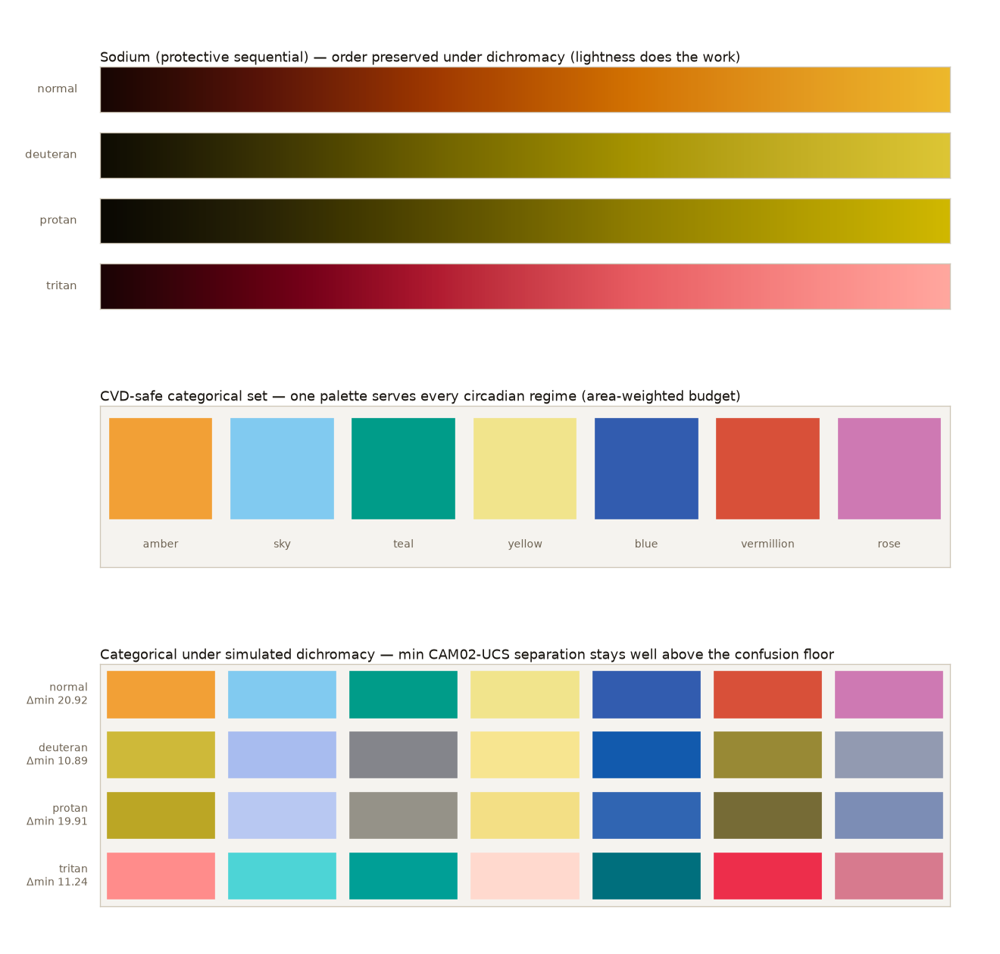

# The melanopic axis

Colormap craft is mature and well organized — but around **two** axes:

1. **Perceptual uniformity (PU)** — equal steps in the data look like equal steps in colour.
2. **Colour-vision-deficiency (CVD) safety** — the map still reads under colour blindness.

The viridis family[^viridis], Kovesi's CET maps, Moreland's diverging maps[^moreland], and
Crameri's Scientific Colour Maps[^crameri] are all organized this way; collections sort
themselves by *structure* (Crameri), *domain* (cmocean[^cmocean]), or *data type*
(ColorBrewer[^colorbrewer]) — **none by circadian/melanopic content.** That empty slot is the
opening Melanopy fills.

## A dimension, not a pass/fail rule

PU and CVD-safety are **universal requirements**: every map should clear them. Melanopic
content is different — it is a **design dimension**. Every map sits *somewhere* on it, and
"good/bad" doesn't apply; only *which regime for which context*:

- **protective** — warm, low melanopic ratio (M/P < 1);
- **alerting** — cool / blue-rich, high melanopic ratio (M/P > 1),

with **display white as the unit** (M/P = 1). The metrology underneath is standardized — the
CIE S 026:2018 melanopic action spectrum[^s026], on the α-opic framework of Lucas et
al.[^lucas] — but those tools operate on **spectral power distributions**, not sRGB colormaps.
Melanopy ports the axis to colormaps (see [Rating colormaps](rating.md)); it builds on the
metrology rather than reinventing it.

## The area-weighted melanopic budget

Why does the axis matter for some marks and not others? Because **emitted light scales with
screen area.**

- **Large fills** — spectrograms, density maps, heatmaps — cover a big fraction of the screen,
    so their colour content dominates the light the display emits. The axis matters for them.
- **Small categorical marks** — lines, points, glyphs — emit negligibly regardless of colour.
    For them the axis is effectively *"ignore it"*: one CVD-safe categorical palette serves every
    circadian regime (Melanopy ships exactly one — the `CATEGORICAL_*` palettes).

This split is why Melanopy treats *sequential* fills as the place the melanopic axis earns its
keep, and keeps categorical colour a separate, fixed concern.

{ loading=lazy }

Sodium stays order-preserving under simulated dichromacy (top — lightness does the work); the
single CVD-safe categorical set stays well-separated under colour blindness (middle and bottom),
so one palette serves every circadian regime.

\[^viridis\]: Smith, N. & van der Walt, S. (2015). *A better default colormap for matplotlib.* SciPy.
\[^moreland\]: Moreland, K. (2009). *Diverging color maps for scientific visualization.* ISVC.
\[^crameri\]: Crameri, F., Shephard, G. E. & Heron, P. J. (2020). *The misuse of colour in science communication.* Nature Communications.
\[^cmocean\]: Thyng, K. M. et al. (2016). *True colors of oceanography: guidelines for effective and accurate colormap selection.* Oceanography.
\[^colorbrewer\]: Harrower, M. & Brewer, C. A. (2003). *ColorBrewer.org: an online tool for selecting colour schemes for maps.* The Cartographic Journal.
\[^s026\]: CIE S 026:2018. *CIE system for metrology of optical radiation for ipRGC-influenced responses to light.*
\[^lucas\]: Lucas, R. J. et al. (2014). *Measuring and using light in the melanopsin age.* Trends in Neurosciences.
