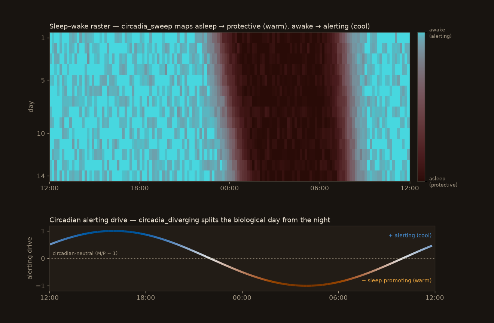

# Cookbook

Short, copy-pasteable recipes. Each is self-contained — `import melanopy as mp` and go.
For the functions they draw on, see the [API reference](reference.md).

## Score a handful of colormaps

Rank any set of Matplotlib colormaps on the melanopic axis. `melanopic_ratio` is the **M/P
mean** — *where* a map sits (display white = 1.0; < 1 protective, > 1 alerting); `mp_spread` is
the **M/P spread (σ)** — *how tightly* it sits.

```python
import matplotlib.pyplot as plt
import numpy as np

import melanopy as mp

for name in ["magma", "viridis", "cividis", "cool", "gray"]:
    c = plt.get_cmap(name)(np.linspace(0, 1, 256))[:, :3]
    s = mp.rate_colormap(c)
    print(f"{name:9s} M/P={s['melanopic_ratio']:.2f}  spread σ={s['mp_spread']:.2f}")
```

For the full pre-computed ranking of common maps, see [The scored index](leaderboard.md).

## Plot a colormap's melanopic profile

The mean and spread summarize a *curve*. Ask for it with `profile=True` and plot the per-position
M/P to see *where* a map dumps its blue — viridis spikes at the dark end (high σ, "smeared"),
while `copper` and `gray` stay flat (low σ, "pure"):

```python
import matplotlib.pyplot as plt
import numpy as np

import melanopy as mp

fig, ax = plt.subplots()
for name in ["viridis", "copper", "gray"]:
    c = plt.get_cmap(name)(np.linspace(0, 1, 256))[:, :3]
    p = mp.rate_colormap(c, profile=True)  # adds positions / ratios / luminance
    ax.plot(p["positions"], p["ratios"], label=f"{name} (σ={p['mp_spread']:.2f})")
ax.axhline(1.0, ls=":", color="grey")  # display white = 1
ax.set(xlabel="data value", ylabel="melanopic ratio (M/P)", ylim=(0, 2))
ax.legend()
plt.show()
```

## Sweep the Circadia family

`mp.circadia(alpha)` walks the axis from protective (`alpha=0`) to alerting (`alpha=1`) while
holding lightness uniform. Sweeping `alpha` and rating each step shows the melanopic ratio
climb monotonically — the dial is an *emergent* property of the OKLab geometry, not a knob
the generator sets.

```python
import matplotlib.pyplot as plt
import numpy as np

import melanopy as mp

alphas = np.linspace(0, 1, 9)
fig, axes = plt.subplots(len(alphas), 1, figsize=(7, 5))
ramp = np.linspace(0, 1, 256).reshape(1, -1)
for ax, a in zip(axes, alphas):
    ax.imshow(ramp, aspect="auto", cmap=mp.circadia(a, as_cmap=True))
    s = mp.rate_colormap(mp.circadia(a))
    ax.set_xticks([])
    ax.set_yticks([])
    ax.set_ylabel(
        f"α={a:.2f}  M/P {s['melanopic_ratio']:.2f}",
        rotation=0,
        ha="right",
        va="center",
        fontsize=8,
    )
fig.tight_layout()
fig.savefig("circadia_family.png", dpi=120)
```

## A live α-slider

Recolour a large fill in real time without touching the data — drag the slider, call
`im.set_cmap`. The SMACC reference app does the same through the pyqtgraph adapter
(`melanopy.adapters.pyqtgraph`); the idea is identical: move α, recolour the fill, never
recompute the data.

```python
import matplotlib.pyplot as plt
import numpy as np
from matplotlib.widgets import Slider

import melanopy as mp

z = np.add.outer(np.sin(np.linspace(0, 6, 200)), np.cos(np.linspace(0, 6, 300)))
z = (z - z.min()) / (z.max() - z.min())

fig, ax = plt.subplots()
fig.subplots_adjust(bottom=0.2)
im = ax.imshow(z, cmap=mp.circadia(0.0, as_cmap=True), aspect="auto")

sax = fig.add_axes([0.2, 0.06, 0.6, 0.04])
slider = Slider(sax, "Circadian (α)", 0.0, 1.0, valinit=0.0)
slider.on_changed(lambda v: (im.set_cmap(mp.circadia(v, as_cmap=True)), fig.canvas.draw_idle()))
plt.show()
```

## Match the map to the data

The melanopic axis isn't only a score to evaluate against — it can *carry* the data's meaning.
When the data is itself circadian, a circadian colormap makes the encoding self-documenting:
let the alerting end mark wakefulness and the protective end mark sleep, and the map's
melanopic axis *is* the sleep–wake axis.

{ loading=lazy }

Reach for the **sequential** `circadia_sweep` for an unsigned state (asleep → awake), and the
**diverging** `circadia_diverging` for a signed quantity (sleep-promoting ↔ alerting, neutral at
the zero crossing). The raster:

```python
import matplotlib.pyplot as plt
import numpy as np

import melanopy as mp

# Wakefulness 0 (asleep) .. 1 (awake) over a noon-to-noon day, for two weeks.
hours = np.linspace(12, 36, 144)
days = np.arange(14)[:, None]
rise = 1 / (1 + np.exp(-2.6 * (hours - (23.2 + 0.11 * days))))  # asleep in the evening
fall = 1 / (1 + np.exp(-2.6 * ((31.4 + 0.04 * days) - hours)))  # awake the next morning
wake = np.clip(1 - rise * fall, 0, 1)

# Sequential: cool = awake (alerting), warm = asleep (protective).
plt.imshow(wake, aspect="auto", cmap=mp.circadia_sweep(as_cmap=True), vmin=0, vmax=1)
plt.show()
```

The full two-panel figure above — including the `circadia_diverging` alerting-drive curve — is
reproducible with `uv run scripts/build_sleep_wake_demo.py`.
