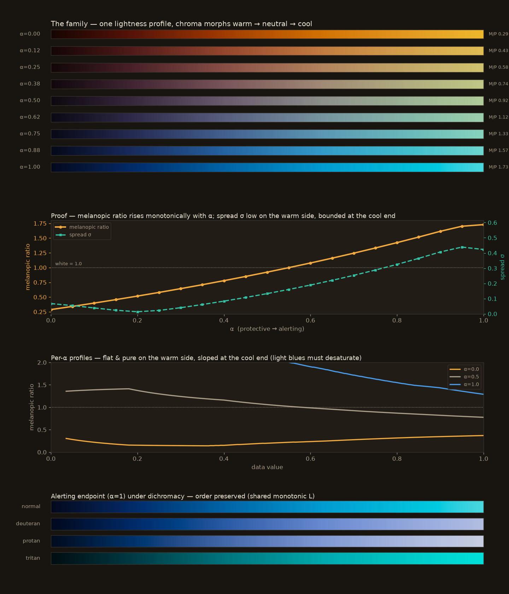

# Cookbook

Short, copy-pasteable recipes. Each is self-contained — `import melanopy as mp` and go. For the
functions they draw on, see the [API reference](reference.md).

```python exec="true" session="mpl"
# Docs setup (hidden): render matplotlib figures inline by making plt.show() emit an SVG.
import matplotlib

matplotlib.use("Agg")
import matplotlib.pyplot as plt


def _render_svg(*args, **kwargs):
    from io import StringIO

    for num in plt.get_fignums():
        buffer = StringIO()
        plt.figure(num).savefig(buffer, format="svg", bbox_inches="tight")
        print(buffer.getvalue())
    plt.close("all")


plt.show = _render_svg
```

## Rank a set of colormaps

`melanopic_ratio` is the **M/P mean** — *where* a map sits (display white = 1.0; under 1
protective, over 1 alerting); `mp_spread` is the **M/P spread (σ)** — *how tightly* it sits.

```python exec="true" source="above" result="text"
import matplotlib.pyplot as plt
import numpy as np

import melanopy as mp

for name in ["copper", "magma", "viridis", "cool", "gray"]:
    c = plt.get_cmap(name)(np.linspace(0, 1, 256))[:, :3]
    s = mp.rate_colormap(c)
    print(f"{name:8s} M/P={s['melanopic_ratio']:.2f}  spread σ={s['mp_spread']:.2f}")
```

## Read a colormap's melanopic profile

The mean and spread summarize a *curve*. Ask for it with `profile=True` to see *where* a map dumps
its blue — viridis spikes at the dark end (high σ, "smeared") while `copper` and `gray` stay flat
(low σ, "pure").

```python exec="true" source="above" result="text"
import matplotlib.pyplot as plt
import numpy as np

import melanopy as mp

for name in ["viridis", "copper", "gray"]:
    c = plt.get_cmap(name)(np.linspace(0, 1, 256))[:, :3]
    p = mp.rate_colormap(c, profile=True)  # adds positions / ratios / luminance
    print(f"{name:8s} σ={p['mp_spread']:.2f}  dark-end M/P={p['ratios'][10]:.2f}  "
          f"mid M/P={p['ratios'][128]:.2f}")
```

To plot the full curve, use `p["positions"]` (the `[0, 1]` data grid) against `p["ratios"]`:

```python exec="true" source="above" html="true" session="mpl"
import matplotlib.pyplot as plt
import numpy as np

import melanopy as mp

fig, ax = plt.subplots()
for name in ["viridis", "copper", "gray"]:
    c = plt.get_cmap(name)(np.linspace(0, 1, 256))[:, :3]
    p = mp.rate_colormap(c, profile=True)
    ax.plot(p["positions"], p["ratios"], label=f"{name} (σ={p['mp_spread']:.2f})")
ax.axhline(1.0, ls=":", color="grey")  # display white = 1
ax.set(xlabel="data value", ylabel="melanopic ratio (M/P)", ylim=(0, 2))
ax.legend()
plt.show()
```

## Sweep the Circadia family

`mp.circadia(alpha)` walks the axis from protective (`alpha=0`) to alerting (`alpha=1`) while
holding lightness uniform. Rating each step shows the melanopic ratio climb monotonically — the
dial is an *emergent* property of the OKLab geometry, not a knob the generator sets.

```python exec="true" source="above" result="text"
import numpy as np

import melanopy as mp

for a in np.linspace(0, 1, 5):
    ratio, spread = mp.circadia_rating(a)
    print(f"alpha={a:.2f}  M/P={ratio:.2f}  spread={spread:.2f}")
```

{ loading=lazy }

## Label a live α-slider with its rated M/P

`α` is a *control* — a geometric position on the OKLab morph — not the melanopic ratio the viewer
receives, and that ratio is **panel-dependent**. `mp.circadia_rating(α, panel=...)` composes the
generator and the rater in one call, so a slider can label itself with the *physical* number for its
configured panel. Drag the slider, call `im.set_cmap` — never recompute the data.

```python
import matplotlib.pyplot as plt
import numpy as np
from matplotlib.widgets import Slider

import melanopy as mp

PANEL = "representative"  # prefer a measured panel for research use — see the API reference

z = np.add.outer(np.sin(np.linspace(0, 6, 200)), np.cos(np.linspace(0, 6, 300)))
z = (z - z.min()) / (z.max() - z.min())

fig, ax = plt.subplots()
fig.subplots_adjust(bottom=0.2)
im = ax.imshow(z, cmap=mp.circadia(0.0, as_cmap=True), aspect="auto")


def relabel(a):
    ratio, spread = mp.circadia_rating(a, panel=PANEL)  # the rated, panel-aware M/P
    ax.set_title(f"α = {a:.2f}  →  M/P = {ratio:.2f}  (σ = {spread:.2f}, {PANEL})")


def on_change(a):
    im.set_cmap(mp.circadia(a, as_cmap=True))  # recolour the fill; never recompute the data
    relabel(a)
    fig.canvas.draw_idle()


sax = fig.add_axes([0.2, 0.06, 0.6, 0.04])
slider = Slider(sax, "α", 0.0, 1.0, valinit=0.0)
relabel(0.0)
slider.on_changed(on_change)
plt.show()
```

The initial title reads `α = 0.00  →  M/P = 0.29  (σ = 0.07, representative)`. The SMACC reference
app does the same through the pyqtgraph adapter (`melanopy.adapters.pyqtgraph`).

## Accent marks over a circadian fill

Overlaying ticks, points, or event lines on a Circadia fill? `CIRCADIA_ACCENT` holds vivid colours
chosen to sit outside the family's colour footprint — so they pop over a warm *or* a cool fill —
and to stay distinct under colour blindness.

```python exec="true" source="above" html="true" session="mpl"
import matplotlib.pyplot as plt
import numpy as np

import melanopy as mp

z = np.add.outer(np.sin(np.linspace(0, 6, 200)), np.cos(np.linspace(0, 6, 300)))

fig, ax = plt.subplots()
ax.imshow(z, aspect="auto", cmap=mp.circadia(0.0, as_cmap=True))  # warm Sodium fill
for i, color in enumerate(mp.CIRCADIA_ACCENT):  # event markers that stay legible over it
    ax.axvline(40 + i * 45, color=color, lw=2.5)
plt.show()
```

## Match the map to the data

The melanopic axis can *carry* the data's meaning, not just score it. When the data is itself
circadian, let the alerting end mark wakefulness and the protective end mark sleep, and the map's
melanopic axis *is* the sleep–wake axis. Reach for the **sequential** `circadia_sweep` for an
unsigned state (asleep → awake), and the **diverging** `circadia_diverging` for a signed quantity
(sleep-promoting ↔ alerting, neutral at the zero crossing).

```python
import matplotlib.pyplot as plt
import numpy as np

import melanopy as mp

# Wakefulness 0 (asleep) .. 1 (awake) over a noon-to-noon day, for two weeks.
hours = np.linspace(12, 36, 144)
days = np.arange(14)[:, None]
rise = 1 / (1 + np.exp(-2.6 * (hours - (23.2 + 0.11 * days))))  # asleep in the evening
fall = 1 / (1 + np.exp(-2.6 * ((31.4 + 0.04 * days) - hours)))  # awake the next morning
wake = np.clip(1 - rise * fall, 0, 1)

# Sequential: cool = awake (alerting), warm = asleep (protective).
plt.imshow(wake, aspect="auto", cmap=mp.circadia_sweep(as_cmap=True), vmin=0, vmax=1)
plt.show()
```

{ loading=lazy }

The full two-panel figure — including the `circadia_diverging` alerting-drive curve — is
reproducible with `uv run scripts/build_sleep_wake_demo.py`.
