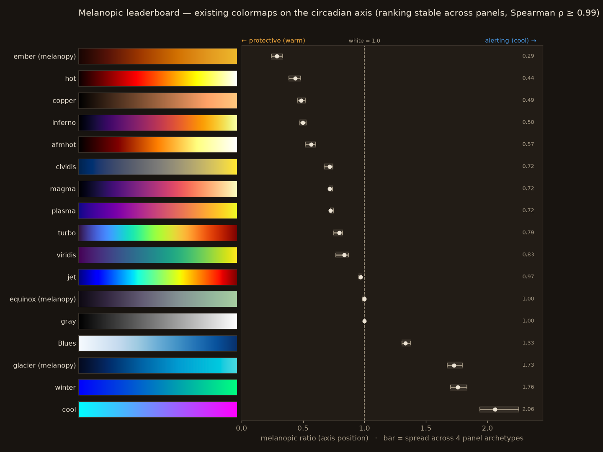

# The scored index

Melanopy ships a scored index of common colormaps so you can see the axis populated by maps
people already use. Regenerate it from the package with `uv run scripts/build_leaderboard.py`.

{ loading=lazy }

## Where common maps land

Display white = 1.0; representative panel.

| colormap | M/P | σ (purity) | regime |
|---|---|---|---|
| **ember** (melanopy) | 0.29 | 0.07 | protective, pure |
| copper | 0.49 | 0.03 | protective, pure |
| inferno | 0.50 | 0.45 | mid, smeared |
| cividis | 0.72 | 0.44 | mid, smeared |
| viridis | 0.83 | 0.56 | mid, smeared |
| **equinox** (melanopy) | 1.00 | 0.16 | neutral |
| gray | 1.00 | 0.00 | neutral |
| Blues | 1.33 | 0.40 | alerting |
| **glacier** (melanopy) | 1.73 | 0.42 | alerting, ~PU/CVD |
| cool | 2.06 | 0.58 | alerting, not PU |

Three findings fall out:

- **Protective + pure already exists.** `copper` (0.49, σ 0.03) and **Ember** (0.29) sit low
  and flat — a warm, circadian-pure sequential map has been hiding in matplotlib all along.
- **Popular PU maps are *smeared*.** viridis / magma / inferno / cividis / plasma sit mid-axis
  but dump high-melanopic blue at their dark (low-data) end — none is circadian-pure (σ ≈ 0.4–1.0).
- **The genuine gap is a pure *alerting* map.** Existing cool maps (`cool`, `winter`, `Blues`)
  reach the alerting end but are not perceptually uniform or are single-hue. That is the slot
  the generator's **Glacier** endpoint is built to fill (see [The Diel family](generator.md)).

## Robust to the display panel

The single biggest question for a rater like this is: *does the ranking survive a different
display?* Each map was re-scored under all four panel archetypes (`melanopy.coeffs.PANELS`);
regenerate with `uv run scripts/build_panel_robustness.py`.

- Absolute M/P **is** panel-dependent — the blue coefficient ranges ≈ 8.8 (OLED) to ≈ 13.7
  (wide-gamut QD).
- The **ranking is not**: **Spearman ρ ≥ 0.99** vs the representative panel.
- Display **white stays exactly 1.0** on every panel.
- The widest per-map band is the saturated `cool` (≈ 0.32 across panels).

So *where* a map sits on the axis is a property you can trust without knowing the exact monitor.
