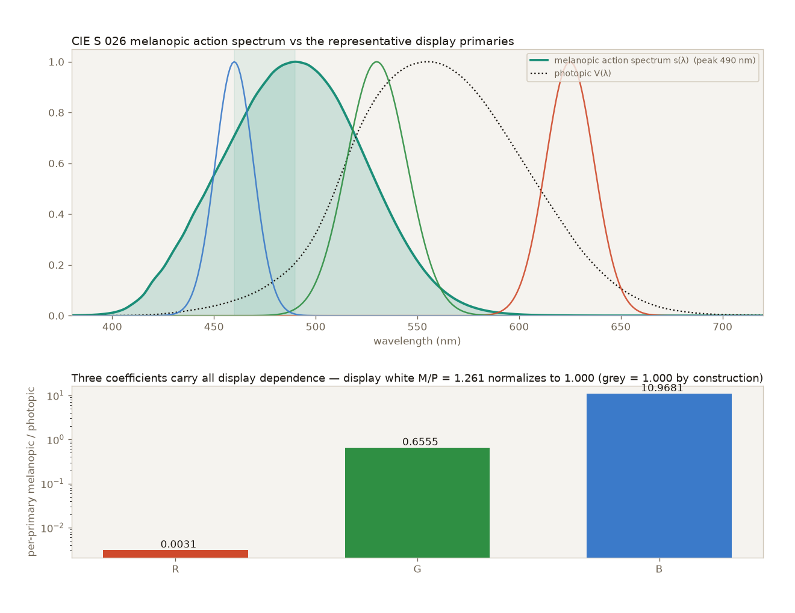
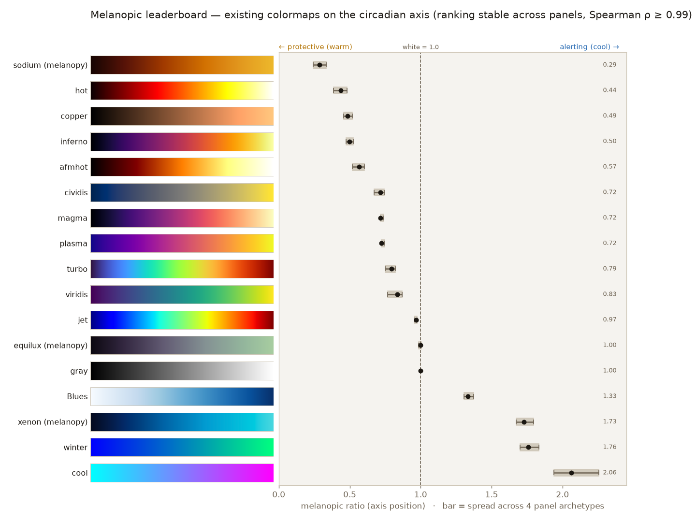

## Abstract

A scientific colormap is crafted to be *read* — perceptually uniform (equal data steps
look equal) and robust to colour-vision deficiency (CVD). But on a self-luminous display it
is also *light*: a large data-fill emits a substantial fraction of the screen's output, and
the short-wavelength, melatonin-suppressing (**melanopic**) content of that light matters
whenever a display is a viewer's dominant light source at night — sleep laboratories,
observatories, neonatal intensive care, overnight radiology, and control rooms. **Melanopy**
makes a colormap's melanopic content *measurable*, accounting for perceptual uniformity and
CVD-safety alongside it rather than layering on top of them. All of a display's dependence
collapses into **three per-primary melanopic/photopic coefficients** derived from the
CIE S 026:2018 melanopic action spectrum, reducing the melanopic content of any sRGB colour
to a weighted sum of three numbers. From these we report two luminance-weighted quantities
per map: an **M/P mean** (where the map sits on the axis, normalized so display white = 1)
and an **M/P spread** (how tightly that ratio sits along the ramp). Scoring the colormaps
people already use yields three findings: a warm, pure sequential map *already exists*
(`copper`, and our `sodium`); the popular perceptually-uniform maps are *smeared* (viridis
and its siblings dump high-melanopic blue at their dark, low-data end); and the genuine gap
is a perceptually-uniform, CVD-safe **alerting** map. We fill it with the **Circadia
family**, a one-parameter generator whose single design dial α walks the axis (measured M/P
0.29 → 1.73) while holding perceptual uniformity and CVD-recoverability fixed — by sharing a
single monotone-lightness profile across α and letting it steer only chroma. We are explicit
about scope: we rate a colour's *chromaticity*, not a light *dose*, and the physiological
effect of a colormap alone is second-order. The contribution is the measurement, the scored
index *and the empirical findings it yields*, the constrained generator, and surfacing a
design dimension the field has not named. The rater, index, generator, and figures are
reproducible from the open-source package.

## 1. Introduction

Most guidance on scientific colormaps optimizes how a map is *read*: whether equal
differences in the data produce equal perceived differences in colour (**perceptual
uniformity**), and whether that reading survives **colour-vision deficiency (CVD)**. Modern
map design is organized around these together with monotone ordering — the viridis family was
built to be uniform and CVD-robust [@smith2015viridis], cividis optimizes explicitly for CVD
[@nunez2018cividis], Kovesi's CET maps systematize uniformity [@kovesi2015colourmaps],
Moreland's diverging maps solved the midpoint problem for signed data [@moreland2009diverging],
and Crameri's work documents how much colour misuse still distorts science
[@crameri2020colour]. These are the right priorities for almost every figure.

But a colormap is also *light*. On a self-luminous display a large data-fill — a spectrogram,
a density map, a heat map — covers a substantial fraction of the screen and therefore emits a
substantial fraction of the screen's light. When the viewer is in a dark room and the display
is their dominant light source, the *spectrum* of that emitted light is not cosmetic: short
wavelengths drive the intrinsically photosensitive retinal ganglion cells (ipRGCs) that
regulate the circadian system and acutely suppress melatonin
[@lucas2014melanopsin; @brown2020melanopic]. This situation is not exotic. Sleep
laboratories, observatories, neonatal intensive-care units, overnight radiology reading
rooms, and 24-hour control centres all put practitioners in front of data displays at night,
deliberately in dim surroundings. Our own motivating deployment is SMACC, a sleep/dream-research
acquisition tool whose operators watch live EEG spectrograms through the night (§4.1). In all
of these settings the colour content of the large fills can *cooperate with* — or *fight* —
whatever circadian-lighting strategy the room is running.

Colormap craft offers no vocabulary for this. Where collections add organizing structure,
they sort by *structure* itself (Crameri), by *domain* (cmocean [@thyng2016cmocean]), or by
*data type* (ColorBrewer [@harrower2003colorbrewer]) — **none by circadian or melanopic
content.** Perceptual uniformity and CVD-safety are, in effect, the two axes the field already
navigates; melanopic content is a further design dimension it has not named, and that empty
slot is the opening this paper fills.

The metrology to fill it already exists. Quantifying melanopic light is a solved, standardized
problem: the CIE S 026:2018 system defines the melanopic action spectrum and the α-opic
quantities [@cie_s026_2018], formalizing the framework of Lucas et al. [@lucas2014melanopsin];
melanopic equivalent daylight illuminance predicts circadian responses across a wide range of
conditions [@brown2020melanopic]; and validated open implementations exist (luox
[@spitschan2021luox], LuxPy, and Colour). Crucially, these tools take **spectral power
distributions** as input. They do not answer "where does viridis sit?", because a colormap is
a list of sRGB triples, not a spectrum. We build directly on this metrology rather than
reinventing it; our work is the missing adapter from colormaps to the established melanopic
measure.

We contribute: (i) a **rater** that scores any colormap on a melanopic axis; (ii) a **scored
index** of common colormaps, which empirically settles how much new map design is even needed;
(iii) a one-parameter **generator** that walks the axis while preserving uniformity and
CVD-safety; and (iv) a reference **application** that exposes the parameter as a live control.
The concept and the index are the headline; the generated maps are a worked example.

## 2. The melanopic axis

### 2.1 Axis definition and spectral weighting

The central conceptual move is to treat melanopic content as a **design dimension, not a
pass/fail rule**. Perceptual uniformity and CVD-safety are *universal requirements*: every map
should clear them, and a map that fails is simply worse. Melanopic content is different. Every
map sits *somewhere* on the axis, and "good/bad" does not apply — only *which regime suits
which context*:

- **protective** — warm, low melanopic ratio (M/P < 1);
- **alerting** — cool / blue-rich, high melanopic ratio (M/P > 1),

with **display white as the unit** (M/P = 1). A daytime alertness display and an overnight
sleep-lab display want opposite ends of the same axis; neither end is "correct" in the
abstract.

**The area-weighted melanopic budget.** Why does the axis matter for some marks and not
others? Because emitted light scales with screen area. Large fills — spectrograms, density
maps, heat maps — cover a big fraction of the display and dominate the light it emits, so the
axis matters for them. Small categorical marks — lines, points, glyphs — emit negligibly
regardless of their colour, so for them the axis is effectively *"ignore it"*: a single
CVD-safe categorical palette serves every circadian regime. This split is a design principle,
not a limitation: it tells us to spend the melanopic budget on *sequential fills* and to keep
categorical colour a separate, fixed concern. (Melanopy ships exactly one CVD-safe categorical
palette, justified by this argument; it stays well-separated under simulated colour blindness,
Fig. 1.)


**The spectral weighting (CIE S 026).** The melanopic content of light is a standardized
quantity, and we adopt the standard rather than approximate it. Each spectrum is weighted by
the CIE S 026:2018 melanopic action spectrum together with the CIE 1931 2° V(λ) photopic
function, both vendored from the source tables; the ratio of the two integrals is the
melanopic/photopic (M/P) ratio that defines the axis. The melanopic response peaks at **490 nm**
as expected, and display gray stays pinned at **1.000** (Fig. 2). This is the same weighting
the validated luox calculator [@spitschan2021luox] is built on, and we confirm our
implementation against it: Melanopy's spectral engine reproduces the CIE S 026 D65 melanopic
ELR normalization constant — the quantity luox is pinned to — to five significant figures
(1.32621 vs 1.3262 mW/lm), and yields the expected melanopic daylight-efficacy ratios
(mel-DER) for the standard illuminants (D65 = 1.000 by definition, equal-energy = 0.906,
Illuminant A = 0.496). Method and a luox-uploadable spectrum set are in the companion
`luox_crosscheck.md`. The baked coefficients of §2.2 are regression-locked to this spectrum,
so the data and the numbers cannot silently drift apart.



### 2.2 Operationalizing the axis: the rating algorithm

The rater turns a colormap into numbers on the melanopic axis. For each colour in the map:

```
sRGB → linearize → displayed SPD = r·P_R + g·P_G + b·P_B
                 → photopic luminance  Y   (exact sRGB weights)
                 → melanopic           M   (∫ SPD · s_mel,  CIE S 026)
                 → M/P, normalized so display white = 1
```

The pipeline's organizing insight is that, because a display's primaries `P_R, P_G, P_B` are
fixed, the melanopic content of any colour collapses to a weighted sum of **three per-primary
coefficients** — the melanopic/photopic ratio of each RGB primary. For the representative
panel:

| primary | coefficient (M/P) |
| ------- | ----------------- |
| R       | 0.0031            |
| G       | 0.6555            |
| B       | 10.9681           |

The blue primary does almost all of the melanopic work, which is precisely why the axis is
mostly a warm ↔ cool story, and why the warm/cool spread asymmetry of §3 is fundamental
rather than incidental. These three numbers are the entire display-dependent part of the
model.

**Two metrics: where the map sits, and how tightly.** Both reported quantities are
**luminance-weighted**, and near-black pixels (which emit almost nothing) are dropped — a
pipeline-level decision so that neither number is dominated by the dark end of the ramp. A
single mean still hides the structure that matters, so the rater reports **two distinct
quantities** (plus the raw per-position range):

- **M/P mean** — *where* the map sits: the mean of the per-position ratio (display white = 1;
  < 1 protective, > 1 alerting).
- **M/P spread (σ)** — *how tightly* it sits: the spread of the per-position ratio along the
  ramp. A tight spread reads as a "pure" ramp.

These two are the axis's *measured outputs* — distinct from the generator's *input* dial
introduced in §3. They are also independent of each other, and the gap between them is the
point. viridis sits mid-axis (M/P 0.83 — mildly protective on *average*) yet has a high spread
(σ 0.56): it dumps high-melanopic blue at its dark, low-data end, so it is *smeared*, not
tight. A protective mean and a pure ramp are different properties, and a map can have one
without the other. (Concretely, `rate_colormap(viridis)` returns `melanopic_ratio = 0.834`,
`mp_spread = 0.556`, `range = (0.395, 3.069)`.)

**Display-panel dependence.** Melanopic content depends on the display's primary spectra,
which sRGB does **not** fix. The rater therefore takes a `panel` argument selecting among
representative archetypes — narrowband RGB (default), blue-pump white-LED LCD, OLED, and
quantum-dot wide-gamut. Absolute M/P shifts with the panel (the blue coefficient ranges ≈ 8.8
for OLED to ≈ 13.7 for wide-gamut), but the **ranking is robust** to it (§2.3). For exact
numbers on a specific monitor, a user plugs that monitor's measured primary SPDs into
`melanopy.spectra.coefficients_from_primaries` and obtains its own three coefficients —
swapping panels means swapping just those three numbers.

### 2.3 The axis applied to existing colormaps

A rater invites an obvious empirical question — *where do the colormaps people already use
actually land?* — and answering it decides how much new design is needed at all. We scored a
representative set on the default panel (display white = 1; regenerable from the package):

| colormap               | M/P  | σ (spread) | regime           |
| ---------------------- | ---- | ---------- | ---------------- |
| **sodium** (Melanopy)  | 0.29 | 0.07       | protective, pure |
| copper                 | 0.49 | 0.03       | protective, pure |
| inferno                | 0.50 | 0.45       | mid, smeared     |
| cividis                | 0.72 | 0.44       | mid, smeared     |
| viridis                | 0.83 | 0.56       | mid, smeared     |
| **equilux** (Melanopy) | 1.00 | 0.16       | neutral          |
| gray                   | 1.00 | 0.00       | neutral          |
| Blues                  | 1.33 | 0.40       | alerting         |
| **xenon** (Melanopy)   | 1.73 | 0.42       | alerting, ~PU/CVD |
| cool                   | 2.06 | 0.58       | alerting, not PU |



Three findings fall out:

1. **A protective, pure map already exists.** `copper` (M/P 0.49, σ 0.03) and our `sodium`
   (0.29, σ 0.07) sit both low *and* flat — a warm, pure sequential map has been hiding in
   matplotlib all along. No new design is needed at the protective end; it needs only to be
   *named and surfaced*.
2. **The popular uniform maps are smeared.** viridis, magma, inferno, cividis, and plasma sit
   mid-axis but dump high-melanopic blue at their dark (low-data) end — none is tight
   (σ ≈ 0.4–0.6). Choosing one of these "for safety" at night does not buy a low melanopic
   load; it buys a *mixed* one.
3. **The genuine gap is a pure alerting map.** The maps that reach the alerting end — `cool`,
   `winter`, `Blues` — are either not perceptually uniform or single-hue. A
   perceptually-uniform, CVD-safe *alerting* map does not exist off the shelf. That is the one
   slot worth generating, and it motivates the Circadia family's Xenon endpoint (§3).

**Robustness to the display panel and the spectrum.** The single biggest threat to a rater
like this is that its conclusions might be an artifact of one assumed display. We therefore
re-scored every map under all four panel archetypes. Absolute M/P **is** panel-dependent
(driven by the blue coefficient's ≈ 8.8–13.7 range), but the **ranking is not**: Spearman
ρ ≥ 0.99 against the representative panel, with display white pinned at exactly 1.0 on every
panel and the widest single-map band being the saturated `cool` (≈ 0.32 across panels). The
ranking is equally insensitive to the *spectral* choice: replacing an earlier analytic
action-spectrum template with the validated CIE S 026 spectrum (§2.1) moved every map by
≤ 0.035 and left the order intact (Fig. 2). So *where a map sits on the axis* is a property
one can trust without knowing the exact monitor or the fine detail of the action spectrum —
which is what makes the index, not just a single measurement, worth publishing.

## 3. The Circadia family: a uniformity-preserving generator

The leaderboard says the protective end is already covered but the alerting end is not. The
**Circadia family** (`mp.circadia(alpha)`) is a one-parameter generator built to walk the
whole axis without surrendering uniformity or CVD-safety at any point along it.


**The dial and the measurement are different things.** The family's single design parameter is
α ∈ [0, 1], a dimensionless dial we call the **melanopic temperature**: 0 is protective (warm),
1 is alerting (cool). α is an *input* — a geometric position on an OKLab morph (below) — not a
melanopic measurement. What the rater reports, the **M/P mean** and **M/P spread** of §2.2,
are *outputs* measured from the rendered colours. For the Circadia family the M/P mean is an
emergent, monotone function of α (measured 0.29 → 1.73 on the default panel), so turning the
dial does move a map along the axis — but the two are not the same quantity. α is dimensionless
and panel-independent; the M/P mean is a measured optical ratio that shifts with the display.
And the M/P spread is orthogonal to α altogether: the dial sets *where* a map sits, not *how
tightly*, and the warm/cool asymmetry below shows the spread is governed by the gamut, not the
knob. In short, **α is what you set; M/P mean and M/P spread are what you measure.**

| anchor      | α    | M/P (measured) | character                                          |
| ----------- | ---- | -------------- | -------------------------------------------------- |
| **Sodium**  | 0.00 | 0.29           | warm, protective, pure                             |
| **Equilux** | 0.55 | ≈ 1.00         | neutral (M/P = 1 crossover, true α ≈ 0.5505)       |
| **Xenon**   | 1.00 | 1.73           | cool, alerting                                     |

The anchors carry evocative names while the measured quantities keep the precise optical term:
**Sodium**, **Equilux**, and **Xenon** name points on the dial; **M/P mean** and **M/P
spread** name what is measured there — motivation for what is designed, precision for what is
reported.

**Why uniformity comes for free.** The generator is pure OKLab geometry [@ottosson2020oklab];
it never looks at the melanopic coefficients of §2.2. The trick is a **single
monotone-lightness profile shared by every α**. Lightness (the L of OKLab) increases
identically along the ramp for all α, and α morphs *only the chroma vector* — rotating the
warm hue path at α = 0 to the cool hue path at α = 1, with a gamut clamp that reduces chroma
(preserving L and hue) wherever a colour would leave sRGB. Because lightness does all of the
structural work and α only steers chroma, perceptual uniformity and CVD-recoverability hold
for *every* α, and the **melanopic ratio is an emergent, monotone function of α** (0.29 →
1.73) that the generator never computes. The axis falls out of the geometry; it is not imposed
on it.

**Both properties are verified, not assumed.** The generator's structural claims are checked
numerically with `colorspacious`. For perceptual uniformity, the CAM02-UCS lightness (J′) is
strictly increasing along each Circadia map and the CAM02-UCS step sizes are near-constant
(coefficient of variation < 0.30). For CVD, under simulated deuteranopia, protanopia, and
tritanopia (Machado et al. model [@machado2009cvd], severity 100) the perceived lightness
stays strictly monotone, so the data order remains recoverable. We deliberately say
**CVD-recoverable**, not the stronger "CVD-safe": a shared monotone-lightness profile
guarantees recoverable *order*, which is exactly what the tests show and exactly what we claim.
The melanopic span is equally robust to the spectral choice: under the validated CIE S 026
spectrum (§2.1) the generator's range is unchanged (0.29 → 1.73) and still monotone.

**A fundamental warm/cool asymmetry.** Sodium sits far tighter on the axis than Xenon (M/P
spread σ 0.07 vs 0.42), and this is a property of the display gamut, not a tuning miss.
Short-wavelength primaries are intrinsically low-luminance, so *a light, saturated blue does
not exist* — light cool colours must desaturate toward white, where M/P → 1. A perfectly pure
*protective* map is therefore achievable under a shared lightness profile, but a perfectly
pure *alerting* one is not. This is a statement about the intersection of the melanopic axis
with the sRGB gamut, and we report it rather than hide it (§4.2).

## 4. Discussion

The axis, the index, and the generator are only useful if they change practice without
overclaiming. This section closes the loop: how the generator's dial behaves as a live control
(§4.1), what Melanopy deliberately does *not* assert (§4.2), how the contribution sits against
three mature literatures (§4.3), and how all of it reproduces (§4.4).

### 4.1 Reference application: an in-app circadian slider

The generator's α is most useful as a *live control*. SMACC (a PyQt6 + pyqtgraph sleep/dream
research tool) is our reference deployment: α is exposed as a toolbar slider so the screen's
colour temperature can be moved along the melanopic axis during an overnight session without
leaving the app.

**What α controls.** It drives the active scientific colormap for large-fill views — the EEG
spectrogram, hypnogram density, scalp/topographic maps — where the melanopic budget is
non-trivial. Optionally it also drives the UI accent tokens, so chrome and data move together.
Categorical line/scatter views need *not* react: the area-weighted budget (§2.1) says their
emission is negligible. Bindings can be manual (raw α, or labelled presets *Protective /
Neutral / Alerting*), scheduled by the clock (an automatic warm-down across the night), driven
by an ambient-light sensor or an "I'm fading" button, or coupled to the app's theme mode.

**Why in-app, not a global filter.** This is the core justification and a paper-worthy point.
A global gamma/LUT warp such as f.lux or OS Night Shift tints the entire framebuffer
*data-blind* and non-uniformly, which **breaks perceptual uniformity and CVD-safety** for
every figure on screen — and, empirically, a spectral shift without dimming does not reliably
reduce melatonin suppression anyway [@nagare2019nightshift]. Doing the adjustment at the
*data → colour* step instead preserves uniformity and CVD-safety by construction, touches only
the analysis canvas (never a participant-facing display), and lets one dial drive plots and
chrome coherently.

**Honesty surfaced in the UI itself.** The slider changes *appearance* and how the screen
*participates in* the room's circadian strategy; it is **not** an alertness dial. The interface
pairs it with brightness and room-light guidance, restating the governing truth: if the goal
is genuinely to stay awake, light the room — the colormap is a second-order, mostly
non-interference lever.

**Implementation.** A small lookup table of α steps is precomputed at startup (or the 256×3
sRGB array is regenerated on demand, a sub-millisecond cost), wrapped as a `pyqtgraph.ColorMap`
and applied to the relevant `ImageItem`/`PlotItem` LUTs; the slider is debounced to recolor
only, never to recompute the data. α persists in the session config, with an optional schedule
table (α vs. clock time).

### 4.2 Limitations and honest scope

Melanopy's credibility *is* its contribution, so the caveats are stated plainly rather than
buried.

- **It rates chromaticity, not dose.** We report a colour property, never a light dose or an
  alertness effect. Actual circadian load is roughly screen luminance × fraction of screen
  filled × viewing distance × ambient light — none of which a colormap fixes. If the goal is
  genuinely to stay alert, the dominant lever is room lighting.
- **Display-primary dependence.** The three coefficients assume a representative panel; real
  white-LED-LCD, OLED, and wide-gamut displays differ, especially in blue. We ship several
  panel archetypes and let users plug in measured SPDs. S 026 validates the *spectral
  weighting*; the *panel model* is orthogonal and still approximate. Reassuringly, the ranking
  is robust across panels (§2.3).
- **The warm/cool spread asymmetry is fundamental.** A perfectly pure protective map is
  achievable; a perfectly pure alerting one is not, because light saturated blues do not exist
  in the gamut (§3). This is a property of the axis ∩ the display gamut, not a defect to be
  tuned away.
- **"CVD-recoverable", not "CVD-safe".** A shared monotone-lightness profile makes *order*
  recoverable under CVD; we verify that and claim exactly that, no more.
- **The physiological effect is second-order.** The dominant levers are screen brightness, UI
  background, and room light. Melanopy's worth is (a) measurability, (b) the tool and index,
  (c) surfacing the axis, and (d) a modest *non-interference* claim — letting large fills
  cooperate with whatever circadian strategy the room already runs.
- **Prior-art scope.** The novelty claim rests on a structured related-work pass across three
  literatures (§4.3), documented separately, not a full PRISMA systematic review.

### 4.3 Related work and novelty

Three mature fields border this work, and the contribution sits in the gap between them.
(1) **Melanopic metrology:** CIE S 026 [@cie_s026_2018] and validated calculators
[@spitschan2021luox] on the α-opic framework of Lucas et al. [@lucas2014melanopsin], with
melanopic EDI predicting circadian responses [@brown2020melanopic] — all operating on SPDs,
not colormaps. (2) **Colormap craft:** perceptual uniformity, ordering, and CVD-safety
[@smith2015viridis; @nunez2018cividis; @kovesi2015colourmaps; @moreland2009diverging;
@crameri2020colour], with collections organized by structure, domain, or data type
[@thyng2016cmocean; @harrower2003colorbrewer] — none by melanopic content. (3)
**Lighting-domain melanopic modulation**, where the axis idea actually lives, but for lamps
and display *hardware*: metameric display tuning that varies melanopic output independent of
visual appearance [@allen2018metamerism] (the closest prior art — a 5-primary VDU for
melatonin/alertness experiments, *not* a colormap tool), and OS night-shift filters
[@nagare2019nightshift].

The melanopic axis itself is therefore *not* novel — it is mature in lighting. **What is novel
is the port to scientific colormaps as four specific artifacts:** a melanopic *rater for
colormaps*, a *per-data-position* melanopic profile, a *scored index* of existing scientific
maps, and a *perceptual-uniformity- and CVD-constrained generator* parameterized by melanopic
content. We searched the three literatures above and found no precedent for any of the four — a
defensible related-work pass (English-only, without a patent-database sweep), not an exhaustive
systematic review.

### 4.4 Availability and reproducibility

Melanopy is the collection and the open-source Python package (`import melanopy as mp`;
`pip install melanopy`; numpy + matplotlib only at runtime). The code is MIT-licensed; the
vendored CIE reference tables (S 026:2018 and the CIE 1931 2° observer) are © CIE and
redistributed under CC BY-SA 4.0, documented with sources and DOIs. The scored index ships in
the repository and regenerates from the package (`scripts/build_leaderboard.py`); the
panel-robustness analysis and all four figures regenerate the same way
(`scripts/build_panel_robustness.py`, `scripts/build_figures.py`). The validation claims —
the spectral cross-check of §2.1 and the perceptual-uniformity / CVD checks of §3 — are the
test suite (`pytest`), run in CI across a Python/OS matrix. Documentation, including an API
reference, is published at the project site. Every numeric claim in this paper is reproducible
from a clean checkout.

## References

References are generated from `references.bib` via Pandoc `[@key]` citations.
